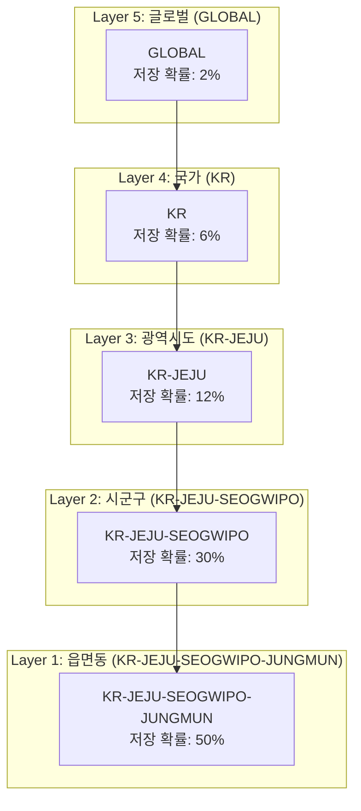
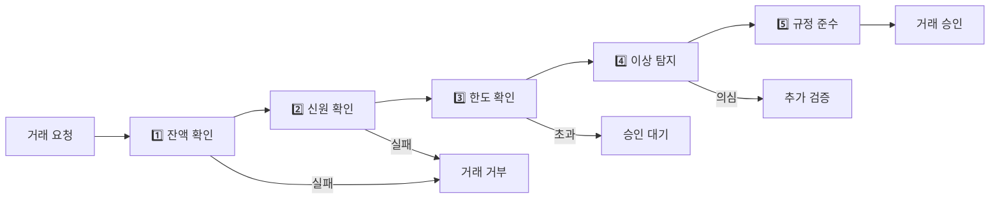
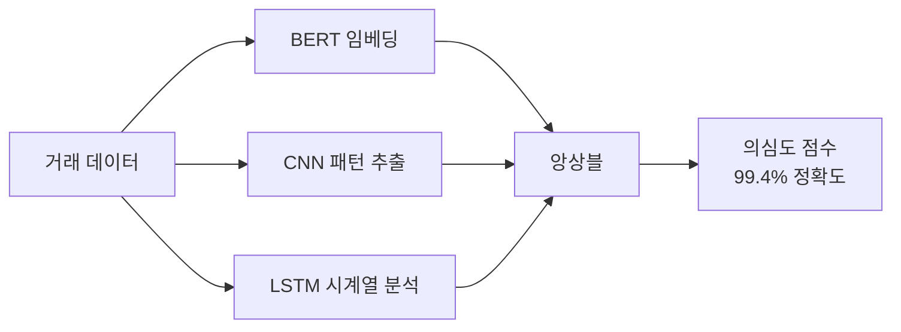
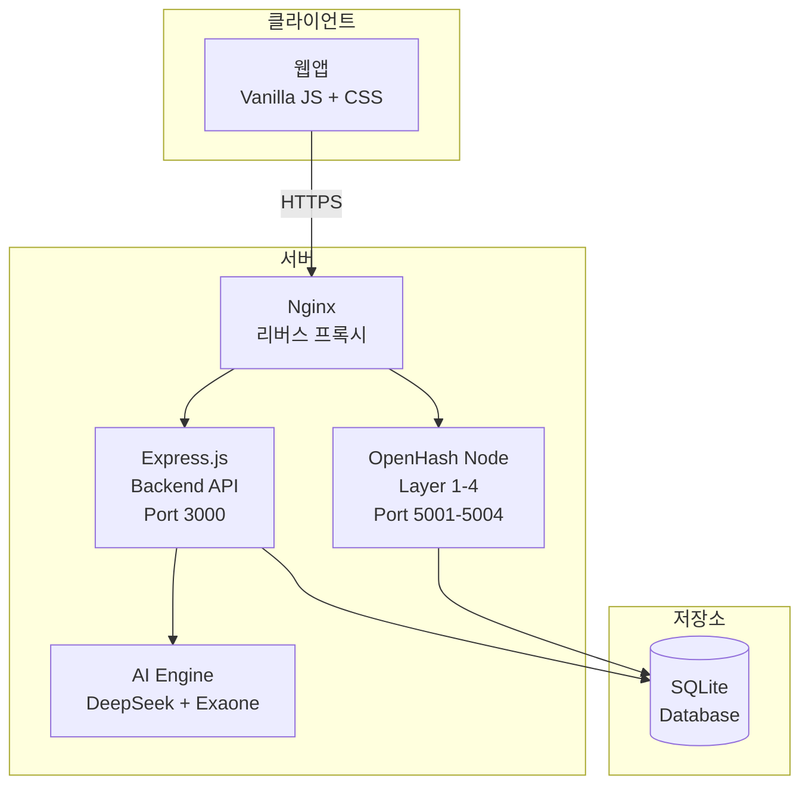

# GOPANG (고팡)

**OpenHash 기반 정부/공공기관 AI 채팅 플랫폼**

[](https://opensource.org/licenses/MIT)
[](https://nodejs.org/)
[](https://www.typescriptlang.org/)

---

## 📋 목차

- [개요](#-개요)
- [OpenHash 기술](#-openhash-기술)
- [AI 아키텍처](#-ai-아키텍처)
- [지원 기관](#-지원-기관)
- [시스템 구성](#-시스템-구성)
- [설치 및 실행](#-설치-및-실행)
- [API 문서](#-api-문서)

---

## 🎯 개요

GOPANG(고팡)은 **OpenHash**와 **AI**를 결합한 차세대 정부/공공기관 통합 서비스 플랫폼입니다.

### 핵심 비전

| 목표 | 설명 |
|------|------|
| 👥 사용자 규모 | 3천만 시민 + 1천만 AI (기관/기업/개인비서) |
| 🏛️ 서비스 범위 | 모든 정부/공공기관을 AI 채팅으로 연결 |
| 💰 결제 시스템 | EGCT 디지털 화폐로 통합 결제 |
| 🔐 개인정보 | Vault(정보금고)로 자기주권 관리 |
| 📝 기록 보존 | OpenHash 분산 저장으로 위변조 방지 |

### 주요 기능

| 기능 | 설명 |
|------|------|
| 🏛️ 기관 AI 상담 | 법원, 검찰, 경찰, 국세청 등 12개 기관 AI와 24시간 상담 |
| 🤖 개인 AI 비서 | 사용자 전용 AI 비서 (Exaone 7.8B 기반) |
| 📄 AI Agent | 소송 서류 작성, 병원 예약 등 자동화 작업 수행 |
| 💰 EGCT 결제 | 디지털 화폐 (1T = 1,000원) |
| 🔐 Vault | 6개 서랍 구조의 개인 정보금고 |
| 📊 자동 재무제표 | AI가 거래 분석하여 5대 재무보고서 자동 작성 |

---

## 🔧 OpenHash 기술

> **OpenHash는 블록체인이 아닙니다.**  
> 기존 통신 인프라의 물리적 계층 구조를 활용하여 **작업증명(PoW)이나 지분증명(PoS) 없이** 데이터 무결성을 확률적으로 보장하는 차세대 분산원장 기술입니다.

### 블록체인 vs OpenHash

| 구분 | 블록체인 | OpenHash |
|------|----------|----------|
| 합의 방식 | PoW/PoS (에너지 소모) | 계층 간 상호 검증 |
| 에너지 | 막대한 전력 소비 | **98.5% 절감** |
| 처리 속도 | 10분 (BTC) / 12초 (ETH) | **4ms 검증, 100ms 확정** |
| 네트워크 | 별도 P2P 구축 | 기존 통신 인프라 활용 |
| 동기화 | 전역 일관성 필요 | 필요 시에만 병합 |

### 5단계 행정 계층 구조


### 핵심 모듈

| 모듈 | 코드 | 기능 |
|------|------|------|
| 확률적 계층 선택 | 300 | SHA-256 이중 해싱으로 저장 계층 결정 |
| 하향식 검증 | 310 | BLS 서명/머클 증명으로 상위→하위 검증 |
| 상향식 감시 | 320 | 하위→상위 이상 동작 실시간 모니터링 |
| 머클 트리 동기화 | 330 | 머클 루트만 전송하여 대역폭 90% 절감 |
| LPBFT 합의 | 340 | 비상시에만 경량화 PBFT 발동 |
| 잔액 불변성 검증 | 350 | 공통 계층 이상 총액 불변 보장 |
| 5단계 거래 검증 | 360 | 잔액→신원→한도→이상탐지→규정준수 |

### 5단계 거래 검증 파이프라인


### 성능 지표

| 지표 | 수치 |
|------|------|
| 에너지 절감 | 98.5% (블록체인 대비) |
| 계층 간 검증 | 4ms |
| 전체 거래 확정 | 100ms 이내 |
| 부정거래 탐지 | 99.4% 정확도 |
| 대역폭 절감 | 90% |
| 통신 비용 절감 | 99% (오프라인 배치) |
| 거래당 데이터 | 128 바이트 |

---

## 🤖 AI 아키텍처

GOPANG은 **2개의 AI 모델**을 역할에 따라 분리 운영합니다.

### DeepSeek R1 API (상담/분석)

| 항목 | 내용 |
|------|------|
| **역할** | 사용자와의 대화, 상담, 정보 제공, 분석 |
| **방식** | 기관별 특화 System Prompt 적용 |
| **데이터** | 사용자 Vault 데이터 참조하여 맞춤형 응답 |
| **분야** | 법률, 의료, 세무 등 전문 분야 상담 |

**기관별 System Prompt:**

| 기관 | System Prompt 핵심 |
|------|-------------------|
| 법원 | 민사/형사 소송 절차, 예상 판결, 법적 근거 조항 제시 |
| 병원 | Vault의 병력/가족력/알레르기 참조, 맞춤 병원 추천 |
| 국세청 | 소득/공제 정보 참조, 세액 계산 및 신고 안내 |
| 특허청 | 발명 자료 분석, 선행기술 조사, 출원 절차 안내 |

### Exaone 7.8B (AI Agent)

| 항목 | 내용 |
|------|------|
| **역할** | 실제 작업 수행 - 서류 작성, 예약, 신청 |
| **특징** | Agent 작업 특화 Fine-tuning 완료 |
| **운영** | 로컬 GPU 서버 (프라이버시 보호) |

**Agent 작업:**

| 기관 | Agent 작업 |
|------|-----------|
| 법원 | 소장, 답변서, 준비서면, 항소장 작성 |
| 검찰 | 고소장, 고발장, 진술서 작성 |
| 병원 | 진료 예약, 검사 예약, 의무기록 사본 신청 |
| 국세청 | 종합소득세/부가세 신고서 작성 |
| 특허청 | 특허 명세서, 출원서 초안 작성 |
| 주민센터 | 전입신고서, 증명서 신청서 작성 |

### AI 검증 모듈 (BERT-CNN-LSTM 앙상블)


---

## 🏛️ 지원 기관

### 사법 기관

| 기관 | 아이콘 | 주요 서비스 |
|------|--------|------------|
| 법원 | ⚖️ | 민사/형사 소송 상담, 소장 작성, 판례 검색 |
| 검찰청 | 🛡️ | 고소/고발 상담, 수사 진행 안내, 피해자 보호 |
| 경찰청 | 👮 | 범죄 신고, 수사 상담, 교통/생활안전 민원 |

### 행정 기관

| 기관 | 아이콘 | 주요 서비스 |
|------|--------|------------|
| 의회 | 🏛️ | 청원 접수, 입법 예고, 의원 면담 신청 |
| 도청 | 🏢 | 광역 행정, 인허가, 보조금/지원사업 |
| 시청 | 🏙️ | 건축/도시계획, 지방세, 복지/문화 |
| 주민센터 | 🏠 | 주민등록, 증명서 발급, 복지 신청 |

### 전문 기관

| 기관 | 아이콘 | 주요 서비스 |
|------|--------|------------|
| 국세청 | 💰 | 세금 신고, 세액 계산, 세무조사 대응 |
| 특허청 | 💡 | 특허/상표/디자인 출원, 심사, 분쟁 상담 |

### 생활 기관

| 기관 | 아이콘 | 주요 서비스 |
|------|--------|------------|
| 병원 | 🏥 | 증상 분석, 병원 추천, 진료 예약 |
| 학교 | 🎓 | 입학/전학, 장학금, 진로 상담 |
| 시장 | 🛒 | 소비자 피해 구제, 상거래 분쟁 |

---

## 🏗️ 시스템 구성

### 아키텍처


### 기술 스택

| 계층 | 기술 |
|------|------|
| Frontend | Vanilla JS, CSS 모듈, Material Icons |
| Backend | Node.js 18+, Express.js, TypeScript |
| Database | SQLite (프로토타입) → Aurora (프로덕션) |
| AI | DeepSeek R1 API, Exaone 7.8B |
| 분산원장 | OpenHash (자체 개발) |
| Infra | AWS EC2, Nginx, PM2 |

### 디렉토리 구조
```
/gopang
├── frontend/           # 프론트엔드
│   ├── index.html      # SPA 진입점
│   ├── css/            # 모듈화된 CSS
│   └── js/             # 모듈화된 JS
├── backend/            # 백엔드 API
│   ├── src/            # TypeScript 소스
│   └── dist/           # 컴파일된 JS
├── openhash/           # OpenHash 노드
├── ai-engine/          # AI 엔진
└── data/               # 데이터베이스
```

---

## 🚀 설치 및 실행

### 요구 사항

- Node.js 18+
- npm 9+
- Python 3.10+ (AI 엔진)

### 설치
```bash
# 저장소 클론
git clone https://github.com/team-jupeter/gopang.git
cd gopang

# 백엔드 설치
cd backend
npm install
cp .env.example .env
# .env 파일에 DEEPSEEK_API_KEY 설정

# 빌드 및 실행
npm run build
npm start
```

### 환경 변수
```env
PORT=3000
DEEPSEEK_API_KEY=your_api_key_here
DATABASE_PATH=/gopang/data/gopang.db
NODE_ENV=production
```

### 접속

- **웹앱**: https://your-domain.com/
- **테스트 계정**: SGP-JM-01 / 1

---

## 📚 API 문서

### 인증 API
```http
POST /api/auth-unified/login/phone
Content-Type: application/json

{
  "identifier": "SGP-JM-01",
  "password": "1"
}
```

### AI 채팅 API
```http
POST /api/ai-chat/chat
Content-Type: application/json

{
  "message": "민사 소송하고 싶어요",
  "userId": "SGP-JM-01",
  "aiType": "court"
}
```

**aiType 옵션:**
- `court` (법원), `prosecution` (검찰), `police` (경찰)
- `assembly` (의회), `province` (도청), `city` (시청), `community` (주민센터)
- `tax` (국세청), `patent` (특허청)
- `hospital` (병원), `school` (학교), `market` (시장)

---

## 🔐 Vault (정보금고)

개인정보 자기주권 관리 시스템 - 6개 서랍 구조

| 서랍 | 저장 정보 |
|------|----------|
| 💰 금융 | 계좌, 카드, 거래내역 |
| 💊 의료 | 병력, 처방, 건강검진 |
| 🎓 교육 | 졸업증명, 성적, 자격증 |
| 📋 행정 | 주민등록, 운전면허, 여권 |
| 🚗 교통 | 차량등록, 운행기록 |
| 📁 일반 | 기타 문서 |

---

## 💰 EGCT 디지털 화폐

**EGCT** (Electronic Government Currency Token)

| 항목 | 내용 |
|------|------|
| 단위 | T (Token) |
| 교환비 | 1T = 1,000원 |
| 용도 | 정부/공공 서비스 결제 |

---

## 📄 라이선스

MIT License - Copyright (c) 2026 Team Jupeter

---

## 🤝 기여

이슈 및 PR 환영합니다.

**Contact:** tensor.city@gmail.com
